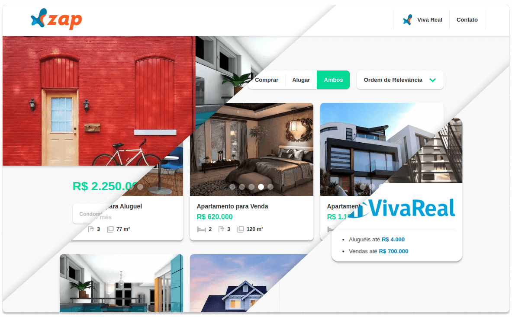
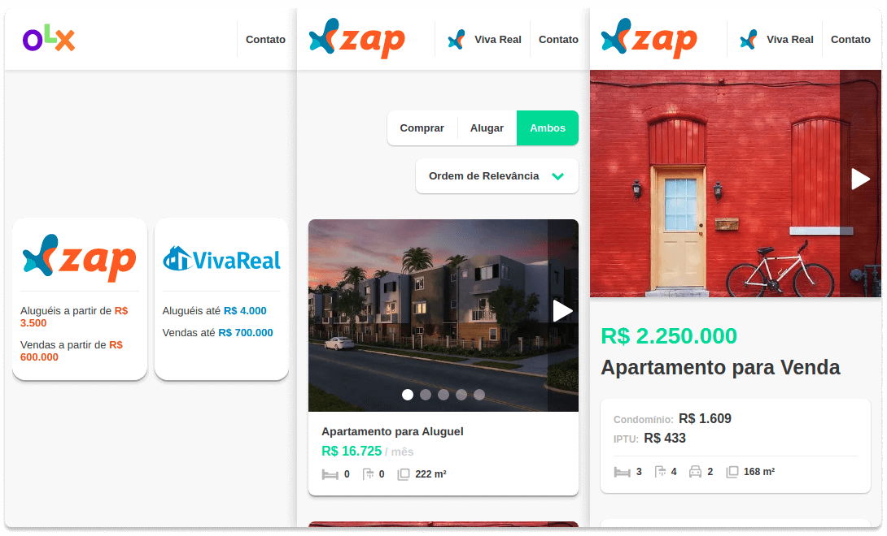

# Desafio OLX

---

Este repositório é uma resposta ao **Desafio da OLX** para desenvolvedores **Front-End**. A aplicação foi desenvolvida com React e Next.JS, utilizando Typescript;

---

## Desktop

<h5 align="center">
  
</h5>

## Mobile

<h5 align="center">
  
</h5>

---

## Instalação

Você precisará ter o **Yarn** instalado no seu computador. Após instalá-lo:
1. Instale o Yarn rodando ``npm install --global yarn`` no terminal.
2. Clone este Repositório.
3. Vá até o diretório do Repositório e rode ``yarn`` para instalar as dependências.

#### Execução

Para executar a aplicação localmente:
- Em modo de desenvolvimento, rode ``yarn dev``.
- Em modo de produção, rode ``yarn server``.

#### Testes

Para executar os testes:
- Rode ``yarn test``.

#### Deploy

Para realizar o deploy da aplicação há um arquivo Dockerfile na raiz do repositório:
1. Rode ``docker build`` para criar a imagem da aplicação.
2. Envie a imagem para o seu orquestrador de container.
3. Para rodar a aplicação conteinerizada, execute ``yarn start -p porta_do_app``.